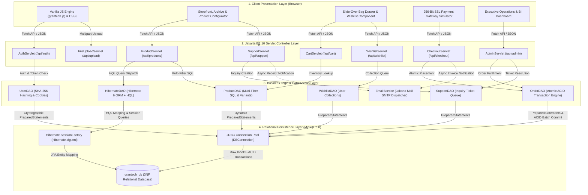
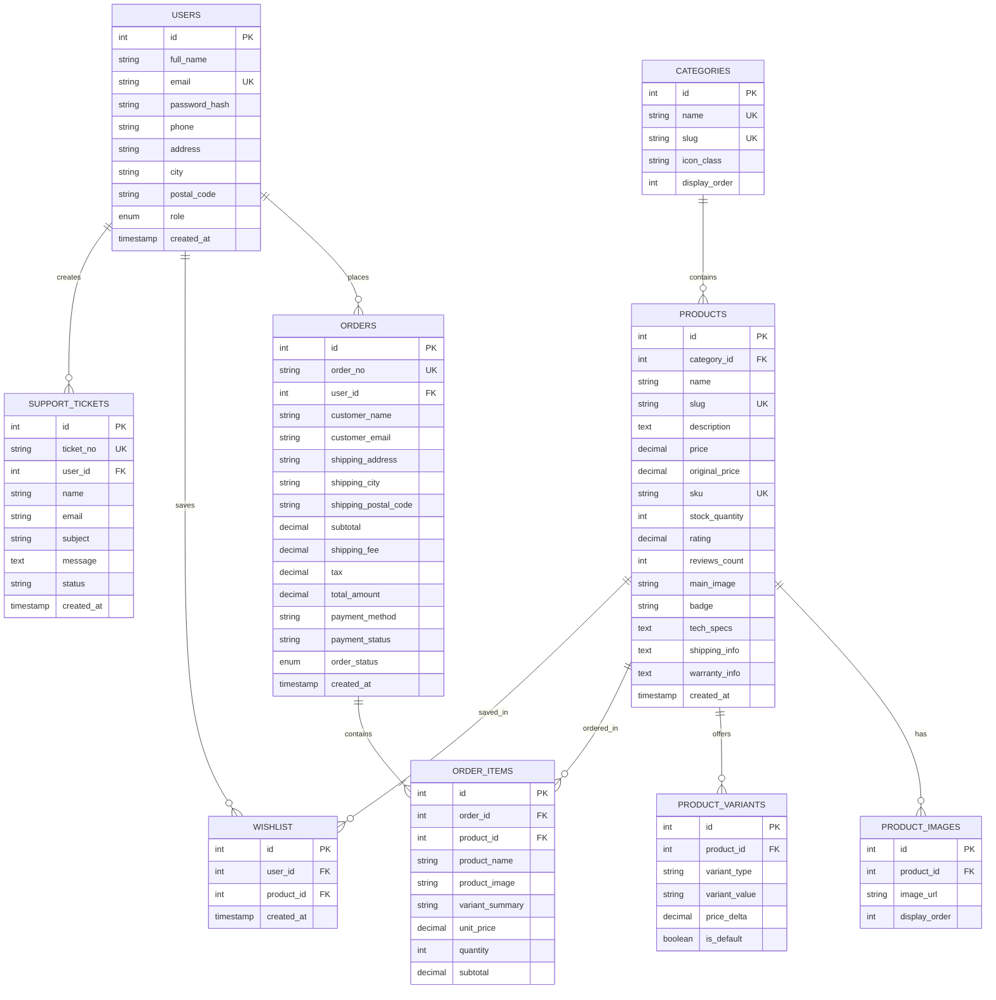

# ⚡ GRAN & TECH — Enterprise E-Commerce Platform v2.2


-EE0000?logo=eclipse&logoColor=white)


An enterprise-grade, full-stack E-Commerce Web Application engineered with **Jakarta EE 10**, **Hibernate 6 ORM (HQL Queries)**, **JDBC ACID Transactions**, **Jakarta Mail SMTP Notifications**, and a **Nordic/Apple minimalist hardware brand aesthetic**. Built according to strict Software Requirements Specifications (SRS) for **Higher Diploma in Software Engineering (Web Programming II / Enterprise Java Applications)**.

Developed by **Kusal Nirmala** (Batch: CO/SE/Intake5).

---

## 📋 Table of Contents
1. [Official Examination Requirements Matrix](#-official-examination-requirements-matrix)
2. [System Architecture](#-system-architecture)
3. [Core Feature Highlights](#-core-feature-highlights)
4. [Technology Stack](#-technology-stack)
5. [Database Architecture (3NF)](#-database-architecture-grantech_db)
6. [Hibernate ORM & HQL Implementation](#-hibernate-orm--hql-implementation)
7. [Getting Started & Local Deployment](#-getting-started--local-deployment)
8. [Demo & Viva Evaluation Credentials](#-demo--viva-evaluation-credentials)
9. [Viva Coding & Theory Preparation Guide](#-viva-coding--theory-preparation-guide)

---

## 🏆 Official Examination Requirements Matrix

The application covers 100% of all required module benchmarks:

| # | Official Minimum Requirement | Technical Implementation in GRAN-TECH | Primary Source Files |
|---|---|---|---|
| **1** | **Min. 5 Business Processes / Use Cases** | **7 Full Business Processes:**<br>1. Client Onboarding & Authentication<br>2. Hardware Catalog Browsing & Filtered Search<br>3. Slide-Over Shopping Cart & Bag Drawer<br>4. ACID-Compliant Checkout & Stock Deduction<br>5. Customer Support Concierge Ticket Queue<br>6. Staff Admin Fulfillment & BI Analytics Reporting<br>7. Profile Asset & Hardware Multimedia Upload | `AuthServlet`, `ProductServlet`, `CartServlet`, `CheckoutServlet`, `SupportServlet`, `AdminServlet`, `FileUploadServlet` |
| **2** | **Normalised Relational Database** | **Third Normal Form (3NF):** 9 normalized MySQL tables with foreign key constraints, cascade rules, and indexes. Zero transitive or partial dependencies. | `schema.sql`, `grantech_db` |
| **3** | **Full CRUD Operations** | • **Create:** Register users, place orders, raise tickets, add wishlist items, upload files.<br>• **Read:** Paginated product archives, order history, KPI aggregates.<br>• **Update:** Order fulfillment status, customer profile, cart quantity, inventory counts.<br>• **Delete:** Remove cart lines, remove wishlist items, cancel orders. | `ProductDAO`, `OrderDAO`, `UserDAO`, `WishlistDAO`, `SupportDAO` |
| **4** | **Hibernate ORM + HQL Queries** | Full JPA/Hibernate 6 mapping (`@Entity`, `@Table`, `@Id`, `@Column`). HQL querying for dynamic search, category lookups, user order retrieval, order status mutations, and revenue aggregates. | `HibernateUtil.java`, `HibernateDAO.java`, `hibernate.cfg.xml`, `models/*` |
| **5** | **AJAX / Fetch API** | Modern asynchronous client-side API requests using ES6 `fetch()`, `async/await`, dynamic DOM updates, and custom context-aware API routing (`GT.apiUrl`). | `assets/js/grantech.js`, Storefront HTML files |
| **6** | **JSON Processing** | Google `Gson` library for serialization and deserialization across all RESTful servlet endpoints. | `com.google.gson.Gson` in all Servlets |
| **7** | **Cart + Payment Gateway + Wishlist** | • Asynchronous slide-over cart drawer & page review.<br>• Interactive 256-bit SSL simulated credit card terminal.<br>• Database-backed persistent user wishlist with pulsing animations. | `cart.html`, `gateway.html`, `WishlistServlet.java`, `WishlistDAO.java` |
| **8** | **Pagination + Advanced Search** | • Real-time debounced instant search autocomplete.<br>• 6-column dense hardware grid (`search.html`) with category pills, price range slider, brand/badge filter, sorting, and numbered page pagination. | `search.html`, `ProductServlet.java`, `grantech.js` |
| **9** | **Session & Cookie ("Remember Me")** | • `HttpSession` tracking active client authentication.<br>• 14-day persistent `HttpOnly` token cookie (`GT_REMEMBER`) with automatic session restoration via `UserDAO.getUserByRememberToken()`. | `AuthServlet.java`, `UserDAO.java` |
| **10** | **File Uploading + Multimedia** | • `FileUploadServlet` (`@MultipartConfig`) with MIME validation and UUID storage.<br>• Embedded HTML5 16:9 cinematic video player showcase on product detail views. | `FileUploadServlet.java`, `product.html` |
| **11** | **SMTP Email Notifications** | Jakarta Mail (`jakarta.mail`) asynchronous email daemon delivering HTML formatted order invoices and support inquiry receipts. | `EmailService.java` |
| **12** | **KPI Reports & BI Reporting** | Real-time administrative KPI cards (Gross Revenue, Active Orders, SKUs, Clients) + instant dynamic CSV Business Intelligence Sales export stream. | `admin.html`, `AdminServlet.java` (`?action=exportReport`) |
| **13** | **Authentication & Authorization** | Role-Based Access Control (`CUSTOMER` vs `ADMIN`). Cryptographic password hashing (SHA-256 + salt). Protected administrative portal routes. | `AuthServlet.java`, `admin.html` |
| **14** | **Error Handling & Exceptions** | Structured JSON error envelopes, SQL transaction rollback on failure, plus custom branded `404.html` and `500.html` error pages declared in `web.xml`. | `web.xml`, `404.html`, `500.html` |

---

## 🏛️ System Architecture

GRAN-TECH is architected following the **Enterprise 4-Tier Web Application Model** (Presentation &rarr; Controller &rarr; Business & Data Access &rarr; Relational Persistence) designed for high concurrency, ACID transaction integrity, and separation of concerns.



### 🏢 Architectural Layer Breakdown

#### Tier 1: Client Presentation Layer (Browser)
* **Zero-Framework Vanilla JS Engine (`grantech.js`):** Lightweight, performant client engine managing application state (`cart`, `wishlist`, `user`), toast notifications, slide-over bag drawer, and live instant search autocomplete.
* **Context-Aware Dynamic API Routing (`GT.apiUrl`):** Intelligently routes API requests dynamically whether hosted under Root Context (`/api/...`) or Tomcat Application Context (`/GRAN-TECH/api/...`).
* **High-Density Responsive Views:** Hand-crafted CSS3 glassmorphism layout, responsive 6-column hardware archive, interactive RAM/SSD hardware configurator, and administrative analytics dashboards.

#### Tier 2: Jakarta EE 10 Servlet Controller Layer
* **Standard Web Servlets (`@WebServlet`):** Non-blocking HTTP GET/POST controllers strictly parsing inputs and routing requests.
* **RESTful JSON Serialization:** Google `Gson` parses incoming JSON request payloads and serializes backend domain objects into standardized JSON envelopes (`{"success": true, ...}`).
* **State & Cookie Management:** Manages stateful client interactions via standard `HttpSession` and long-lived persistent security via `HttpOnly` token cookies (`GT_REMEMBER`).
* **Multipart Media Ingestion:** `FileUploadServlet` leverages `@MultipartConfig` to validate file headers, content length, and MIME types before streaming images to permanent storage.

#### Tier 3: Business Logic & Data Access Layer (DAO / Service)
* **Hibernate 6 ORM Layer (`HibernateDAO`):** Employs JPA entity annotations (`@Entity`, `@Table`, `@ManyToOne`, `@OneToMany`) and Hibernate Query Language (`HQL`) for safe, object-oriented database access, abstraction, and dynamic querying.
* **High-Performance Atomic JDBC Engine (`OrderDAO`):** Handles mission-critical multi-step transactions using manual transaction demarcation (`conn.setAutoCommit(false)`), batch updates (`ps.addBatch()`), stock verification, and automatic rollback on failure (`conn.rollback()`).
* **Asynchronous Notification Daemon (`EmailService`):** Background thread pool executing Jakarta Mail SMTP operations to dispatch HTML invoices and support confirmations without blocking servlet response threads.
* **Cryptographic Security Layer (`UserDAO`):** Enforces SHA-256 password hashing with salt prior to persistent storage.

#### Tier 4: Relational Persistence Layer (MySQL 8.0)
* **Strict Third Normal Form (3NF):** 9 relational tables designed to completely eliminate insertion, update, and deletion anomalies while maintaining referential integrity via foreign key cascades (`ON DELETE CASCADE`, `ON DELETE SET NULL`).
* **Dual Persistence Access:** Supports both Hibernate 6 connection pooling and raw JDBC connection pooling (`DBConnection`) on MySQL InnoDB engine.

---

## ✨ Core Feature Highlights

### 1. 🛍️ Nordic Minimalist Hardware Catalog
* **Aesthetic:** High-contrast `#0a1128` Deep Navy, `#ffffff` pristine slate surfaces, and clean `Inter` typography.
* **Dense 6-Column Archive Grid:** Inspired by modern enterprise marketplaces (AliExpress, Amazon, Apple Store) with responsive reflow from 6 columns down to 2 on mobile devices.
* **Hardware Configurator:** Real-time RAM and SSD upgrade calculations (`+ $400 for 32GB RAM`, `+ $200 for 1TB SSD`) before adding to bag.
* **Multimedia Showcase:** Responsive 16:9 cinematic video player showcase embedded in product specifications.

### 2. ⚡ Slide-Over Shopping Bag & Wishlist
* **Zero Page-Reload Interactivity:** Dynamic slide-over drawer triggered via `GT.toggleBagDrawer()`.
* **Database-Backed Wishlist:** Heart icon toggle backed by `wishlist` relational table, updating live counter badges and client profile collections.
* **Free Freight Indicator:** Live calculation of complimentary worldwide expedited shipping.

### 3. 🛡️ ACID-Compliant Atomic Order Placement
* **Atomic Transactions:** Order placement in `OrderDAO.createOrder()` runs within a single atomic database transaction using `conn.setAutoCommit(false)`.
* **Automatic Stock Deduction:** Product quantities are reduced atomically in the same transaction.
* **Automatic Rollback:** If any item or inventory check fails, `conn.rollback()` executes immediately to prevent corrupted records.

### 4. 💳 Simulated 256-Bit SSL Payment Gateway
* **Interactive Terminal:** Dynamic payment gateway screen mimicking banking iframe checkouts with live card brand auto-detection (Visa, Mastercard, Amex).
* **Formal Tax Invoice:** Generates printable invoices (`success.html`) matching the official university specifications.

### 5. 📊 Executive Admin Console & Business Intelligence
* **Live KPI Metrics:** Real-time tracking of Gross Revenue, Active Orders in pipeline, Active Catalog SKUs, and Registered Accounts.
* **Fulfillment Pipeline:** In-line status updating (`PROCESSING`, `SHIPPED`, `DELIVERED`, `CANCELLED`).
* **BI Sales Reporting:** One-click instant streaming of complete CSV Business Intelligence reports (`GRAN-TECH_Sales_BI_Report.csv`).
* **Manual POS Entry:** Allows staff to register offline phone and in-store orders with custom specifications.

### 6. 🔐 Cryptographic Authentication & Persistent Sessions
* **SHA-256 Hashing:** User passwords salted and hashed with SHA-256 message digests.
* **"Remember Me" Cookie:** 14-day persistent `HttpOnly` token cookie (`GT_REMEMBER`) providing automated frictionless login upon browser restart.

### 7. 📧 Automated SMTP Email Invoicing
* **Jakarta Mail Engine:** Asynchronously sends HTML formatted order invoices upon successful checkout and sends confirmation receipts for customer support inquiries.

---

## 🛠️ Technology Stack

| Layer | Technologies Used |
|---|---|
| **Backend Runtime** | Java 17 LTS, Jakarta Servlet 6.1.0 (Jakarta EE 10) |
| **ORM / Persistence** | Hibernate ORM 6.5.2.Final, Jakarta Persistence API (JPA 3.1) |
| **Servlet Containers** | Apache Tomcat 10.1.60 (Port 8081), Eclipse Jetty 12.0.14 |
| **Database** | MySQL 8.0 (InnoDB Engine, Port 8889 / 3306) via `mysql-connector-j:8.3.0` |
| **JSON Serialization** | Google Gson 2.11.0 |
| **Mail Subsystem** | Jakarta Mail 2.0.1 (SMTP TLS) |
| **Build Automation** | Apache Maven 3.9+ |
| **Frontend UI** | Modern Vanilla JavaScript (ES6+ Async/Await, Fetch API), HTML5 Multimedia |
| **Styling & Assets** | CSS3 Custom Properties, Glassmorphism, FontAwesome Pro Icons |

---

## 🗄️ Database Architecture (`grantech_db`)

The database is fully normalized to **Third Normal Form (3NF)**:



---

## ☕ Hibernate ORM & HQL Implementation

GRAN-TECH features a dedicated Hibernate ORM persistence layer implementing Hibernate Query Language (HQL) via [`HibernateDAO.java`](src/main/java/com/java/institute/grantech/dao/HibernateDAO.java):

```java
// 1. Dynamic Parameterized HQL Search
public static List<Product> searchProductsHQL(String query, Double minPrice, Double maxPrice) {
    try (Session session = HibernateUtil.getSessionFactory().openSession()) {
        StringBuilder hql = new StringBuilder("FROM Product p WHERE 1=1 ");
        if (query != null && !query.isBlank()) {
            hql.append("AND (lower(p.name) LIKE :q OR lower(p.description) LIKE :q) ");
        }
        if (minPrice != null) hql.append("AND p.price >= :minPrice ");
        if (maxPrice != null) hql.append("AND p.price <= :maxPrice ");
        hql.append("ORDER BY p.price ASC");

        MutationQuery or SelectionQuery<Product> q = session.createQuery(hql.toString(), Product.class);
        // Parameter binding protects against HQL injection
        if (query != null && !query.isBlank()) q.setParameter("q", "%" + query.toLowerCase() + "%");
        if (minPrice != null) q.setParameter("minPrice", minPrice);
        if (maxPrice != null) q.setParameter("maxPrice", maxPrice);
        return q.getResultList();
    }
}

// 2. HQL Mutation Update
public static boolean updateOrderStatusHQL(int orderId, String newStatus) {
    Transaction tx = null;
    try (Session session = HibernateUtil.getSessionFactory().openSession()) {
        tx = session.beginTransaction();
        int affected = session.createMutationQuery("UPDATE Order o SET o.orderStatus = :status WHERE o.id = :id")
                .setParameter("status", newStatus)
                .setParameter("id", orderId)
                .executeUpdate();
        tx.commit();
        return affected > 0;
    } catch (Exception e) {
        if (tx != null) tx.rollback();
        return false;
    }
}
```

---

## 🚀 Getting Started & Local Deployment

### Prerequisites
* **Java Development Kit (JDK):** Version 17 LTS or higher
* **Apache Maven:** 3.8+
* **MySQL Database Server:** Local MySQL instance (e.g., port 8889 or 3306)
* **Apache Tomcat 10:** 10.1.x (Port 8081)

### 1. Database Setup
Execute `schema.sql` to initialize the database with seed data:
```bash
mysql -u root -proot -h 127.0.0.1 -P 8889 < schema.sql
```

### 2. Verify Database Configuration
Check [`DBConnection.java`](src/main/java/com/java/institute/grantech/config/DBConnection.java) and [`hibernate.cfg.xml`](src/main/resources/hibernate.cfg.xml):
```xml
<property name="hibernate.connection.url">jdbc:mysql://127.0.0.1:8889/grantech_db?useSSL=false&amp;allowPublicKeyRetrieval=true&amp;serverTimezone=UTC</property>
<property name="hibernate.connection.username">root</property>
<property name="hibernate.connection.password">root</property>
```

### 3. Build WAR Distribution
```bash
mvn clean package -DskipTests
```
This generates `target/GRAN-TECH.war` and the exploded folder `target/GRAN-TECH`.

### 4. Deploy to Apache Tomcat 10
Deploy `target/GRAN-TECH.war` into Tomcat's `webapps/` directory:
* Access via Root Context: **[http://localhost:8081/](http://localhost:8081/)**
* Access via GRAN-TECH Context: **[http://localhost:8081/GRAN-TECH/](http://localhost:8081/GRAN-TECH/)**

---

## 🔑 Demo & Viva Evaluation Credentials

Two **1-click autofill buttons** are available on the [Sign In Page](http://localhost:8081/sign-in.html):

| Role | Email Address | Password | Permissions & Available Controls |
|---|---|---|---|
| **System Administrator** | `admin@grantech.com` | `admin123` | Full access to Executive Admin Console, Live KPIs, Status Fulfillment, Support Queue, and BI CSV Export. |
| **Verified Client** | `kusal@grantech.com` | `password123` | Profile management, past order history, persistent wishlist, cart checkout. |

---

## 🎓 Viva Coding & Theory Preparation Guide

Be prepared to answer these common viva/presentation questions:

### Q1: Why did you choose Hibernate ORM alongside raw JDBC?
> *"We utilized JDBC for performance-critical atomic batch operations like multi-item order checkouts where immediate low-level transactional commit/rollback (`conn.commit()` / `conn.rollback()`) guarantees strict ACID compliance. Concurrently, we implemented Hibernate 6 ORM to benefit from object-relational mapping, type-safe entity lifecycles, and database independence using HQL (Hibernate Query Language) for complex querying and domain object persistence."*

### Q2: How does your application prevent SQL Injection?
> *"All SQL and HQL queries utilize parameterized statements (`PreparedStatement.setString()` in JDBC and `.setParameter()` in Hibernate). No raw user input is concatenated into query strings."*

### Q3: How is the 'Remember Me' feature securely implemented?
> *"When 'Remember Me' is checked, the server generates a cryptographically random UUID token, stores it in the `users` table via `UserDAO.saveRememberToken()`, and writes an `HttpOnly` cookie (`GT_REMEMBER`) with a 14-day expiry. When the user returns with an expired `HttpSession`, `AuthServlet.doGet()` detects the cookie, validates the token against the database, and automatically reconstructs the user's session."*

### Q4: How is database normalization maintained?
> *"The database satisfies 3NF: 1NF is achieved as all attributes contain atomic values (no repeating groups or comma-separated lists). 2NF is achieved because all non-key attributes are fully functionally dependent on primary keys (e.g., variant options exist in `product_variants`). 3NF is achieved because no transitive dependencies exist (e.g., category details reside in `categories`, referenced only by foreign key)."*

---

## 👨‍💻 Author & Academic Attribution

* **Student:** Kusal Nirmala (souron_xn)
* **Intake / Batch:** CO/SE/Intake5
* **Module:** Web Programming II & Enterprise Java Development
* **Institution:** Higher Diploma in Software Engineering
* **GitHub Repository:** [https://github.com/kusalxn0506/GRAN-TECH.git](https://github.com/kusalxn0506/GRAN-TECH.git)
* **Version:** 2.2 (Release Candidate)
