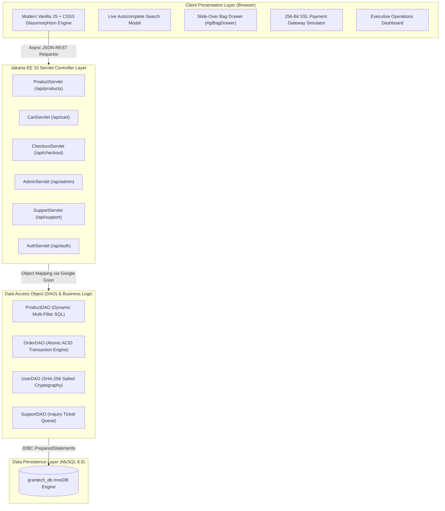

# ⚡ GRAN & TECH — Enterprise E-Commerce Platform v1.0


-EE0000?logo=eclipse&logoColor=white)


An enterprise-grade, full-stack E-Commerce Web Application engineered with **Jakarta EE 10**, **JDBC ACID Transactions**, and a **Nordic/Apple minimalist hardware brand aesthetic**. Built according to strict Software Requirements Specifications (SRS) for **Web Programming II**.

Developed by **Kusal Nirmala**.

---

## 🏛️ System Architecture



---

## ✨ Key Feature Highlights

### 1. 🛍️ Luxury Hardware Showcase & Configurator
* **Nordic Minimalist Aesthetic:** Engineered with high-contrast `#0a1128` Deep Navy, `#ffffff` pristine slate surfaces, and `Inter` typography.
* **Studio Photography:** High-resolution hardware imagery with responsive zoom and interactive thumbnail galleries.
* **Live Variant Recalculation:** Real-time RAM and SSD upgrade pricing calculations (`+ $400 for 32GB RAM`, `+ $200 for 1TB SSD`) before adding to bag.

### 2. ⚡ Asynchronous Slide-Over Shopping Bag
* **Zero Page-Reload Interactivity:** Dynamic slide-over drawer triggered via `GT.toggleBagDrawer()`.
* **State Synchronization:** Cart items, item quantities, and subtotal amounts update seamlessly without full page refreshes.
* **Free Freight Indicator:** Live calculation of complimentary worldwide expedited shipping.

### 3. 🛡️ ACID-Compliant Atomic Checkout
* **Zero Inconsistent States:** `OrderDAO.createOrder()` runs within a single atomic database transaction using `conn.setAutoCommit(false)`.
* **Automatic Inventory Decrementing:** Product stock counts are reduced atomically upon payment authorization.
* **Automatic Rollback:** If any line item or stock check fails, `conn.rollback()` triggers immediately, preventing corrupted or phantom orders.

### 4. 💳 Simulated 256-Bit SSL Payment Gateway
* **Interactive Terminal:** Dynamic payment gateway screen mimicking high-security banking iframe checkouts.
* **Card Brand Auto-Detection:** Automatically detects Visa and MasterCard prefixes as the customer types.
* **Formal Tax Invoice:** Generates printable invoices matching the official university SRS specification.

### 5. 📊 Executive Operations Admin Console
* **Real-Time KPI Cards:** Displays Gross Revenue, Active Orders in pipeline, Active Catalog SKUs, and Verified Accounts.
* **Transaction Control:** In-line dropdown to update order fulfillment status (`PROCESSING`, `SHIPPED`, `DELIVERED`, `CANCELLED`).
* **Support Ticket Queue:** Live monitoring and dispatching of customer inquiries (`TCK-XXXX`).
* **Manual POS Entry:** Allows staff to register offline phone and in-store orders with custom variants.

### 6. 🔐 Cryptographic Authentication & Security
* **SHA-256 Hashing:** User passwords are encrypted with SHA-256 message digests before hitting MySQL disks.
* **Session Management:** Secure HTTP session handling with automatic session cart transfer and role-based route guards.

---

## 🛠️ Technology Stack

| Layer | Technologies Used |
|---|---|
| **Backend Runtime** | Java 17 LTS, Jakarta Servlet 6.1.0 (Jakarta EE 10) |
| **Servlet Containers** | Apache Tomcat 10.1.60, Eclipse Jetty 12.0.14 |
| **Database** | MySQL 8.0 (InnoDB Engine, Port 8889) via `mysql-connector-j:8.3.0` |
| **Serialization** | Google Gson 2.11.0 (Fast JSON serialization/deserialization) |
| **Build & CI/CD** | Apache Maven 3.9+ |
| **Frontend UI** | Modern Vanilla JavaScript (ES6+ Async/Await, Fetch API), Semantic HTML5 |
| **Styling & Assets** | CSS3 Custom Properties, Glassmorphism, FontAwesome Pro Icons |

---

## 🗄️ Database Architecture (`grantech_db`)

The database is normalized to Third Normal Form (3NF):

* **`users`**: Client credentials, cryptographic password hashes, delivery addresses, and privilege roles (`CUSTOMER`, `ADMIN`).
* **`categories`**: Hardware categories (Computers, Phones, Wearables, Audio, Displays, Drones, Smart Home).
* **`products`**: Flagship hardware SKUs, pricing, stock levels, rating metrics, and technical specifications.
* **`product_images`**: Multi-angle gallery photography linked to each product.
* **`product_variants`**: Factory RAM and NVMe SSD expansions with price adjustments.
* **`orders`**: Transaction master records with unique tracking codes (`GT-8492` to `GT-8494`), customer contact info, totals, and statuses.
* **`order_items`**: Immutable line items recording historical unit prices, quantities, and chosen variant configurations at time of purchase.
* **`support_tickets`**: Client support inquiries with sequential ticket identifiers (`TCK-1043`).

---

## 🚀 Getting Started

### Prerequisites
* **Java Development Kit (JDK):** Version 17 LTS or higher
* **Apache Maven:** 3.8+
* **MySQL Database:** Local MySQL server (e.g., MAMP port 8889 or standalone port 3306)

### 1. Database Initialization
Import the provided `schema.sql` file into your MySQL server:
```bash
mysql -u root -proot -h 127.0.0.1 -P 8889 < schema.sql
```

### 2. Configure Database Credentials
Verify [`DBConnection.java`](src/main/java/com/java/institute/grantech/config/DBConnection.java) matches your local MySQL port and credentials:
```java
private static final String URL = "jdbc:mysql://127.0.0.1:8889/grantech_db?useSSL=false&allowPublicKeyRetrieval=true&serverTimezone=UTC";
private static final String USER = "root";
private static final String PASS = "root";
```

### 3. Run with Eclipse Jetty (Recommended for Rapid Testing)
```bash
mvn jetty:run
```
Open **[http://localhost:8080](http://localhost:8080)** in your browser.

### 4. Deploy to Apache Tomcat 10
Build the `.war` distribution:
```bash
mvn clean package
```
Deploy the generated `target/grantech-1.0-SNAPSHOT.war` into Tomcat's `webapps/` folder as `ROOT.war`, or run via IntelliJ IDEA with Tomcat Local configuration.

---

## 🔑 Demo & Viva Evaluation Credentials

On the [Sign In Portal](http://localhost:8080/sign-in.html), two **1-click autofill buttons** are provided:

| Role | Email Address | Password | Privileges |
|---|---|---|---|
| **System Administrator** | `admin@grantech.com` | `admin123` | Full access to Executive Admin Console, Live KPIs, Status Updates, Support Queue. |
| **Verified Client** | `kusal@grantech.com` | `password123` | Personal profile management, past order history tracking, direct checkout. |

---

## 👨‍💻 Author & Academic Attribution

* **Student:** Kusal Nirmala
* **Module:** Web Programming II (Higher Diploma in Software Engineering)
* **Version:** 1.0 (Production Candidate)
* **Specification Document:** `SRH (HF2L_04-AS-02).pdf`
