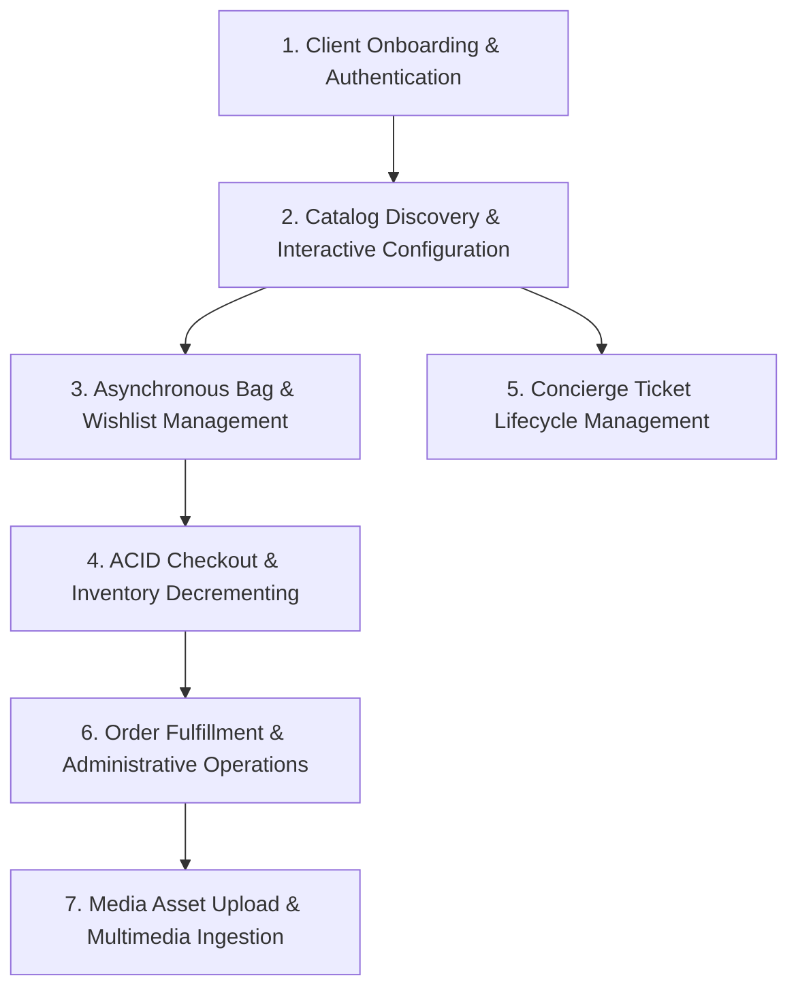
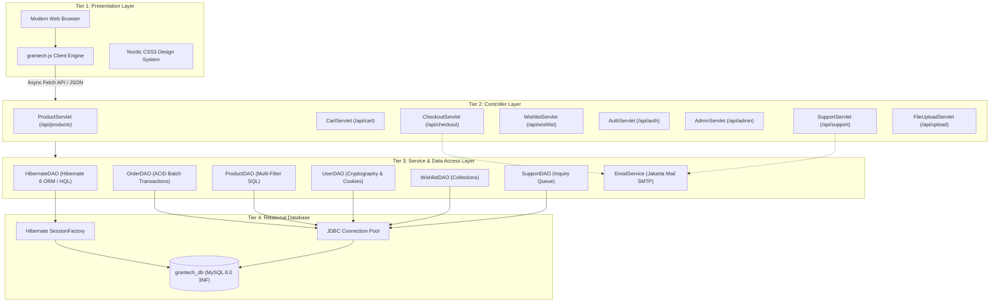
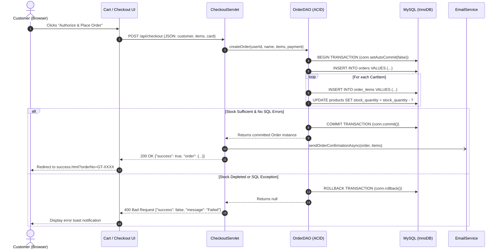

# HIGHER DIPLOMA IN SOFTWARE ENGINEERING
## MODULE: WEB PROGRAMMING II (HF2L)
### ASSESSMENT EX02: WEB APPLICATION DEVELOPMENT PROJECT REPORT

---

# PROJECT TITLE: GRAN-TECH ENTERPRISE HARDWARE ECOSYSTEM
### A Full-Stack E-Commerce Platform Built with Jakarta EE 10, Hibernate 6 ORM, and MySQL

**Student Name:** Kusal Nirmala  
**Student ID:** CODSE24.1F-000  
**Batch / Intake:** CO/SE/Intake5  
**Branch:** National Institute of Business Management (NIBM) / Computing Faculty  
**Module Name:** Web Programming II  
**Unit Code:** HF2L  
**Assessment Type:** EX02 — Web Application Development Project, Solution Demonstration & Live Viva Voce  
**Submission Date:** October 2026  

---

## TABLE OF CONTENTS
1. [Introduction](#1-introduction)
2. [Business Analysis](#2-business-analysis)
3. [System Requirements Specification (SRS)](#3-system-requirements-specification-srs)
4. [System Design & Architecture](#4-system-design--architecture)
5. [Database Design & Normalization](#5-database-design--normalization)
6. [User Interface Design & Experience](#6-user-interface-design--experience)
7. [Front-End Development & Client Architecture](#7-front-end-development--client-architecture)
8. [Back-End Development & Servlet Controllers](#8-back-end-development--servlet-controllers)
9. [Hibernate Framework Implementation](#9-hibernate-framework-implementation)
10. [Database Manipulation & HQL Queries](#10-database-manipulation--hql-queries)
11. [Authentication, Sessions & Security](#11-authentication-sessions--security)
12. [E-Commerce Subsystems](#12-e-commerce-subsystems)
13. [Multimedia & File Uploading](#13-multimedia--file-uploading)
14. [Email & Notification Services](#14-email--notification-services)
15. [Reporting & Business Intelligence (BI)](#15-reporting--business-intelligence-bi)
16. [Error Handling & Exception Management](#16-error-handling--exception-management)
17. [Testing, Verification & System Evaluation](#17-testing-verification--system-evaluation)
18. [Conclusion & Future Enhancements](#18-conclusion--future-enhancements)
19. [References](#19-references)
20. [Appendices](#20-appendices)

---

## 1. INTRODUCTION

### 1.1 Organisational Background
GRAN-TECH is a high-performance computer hardware and luxury electronics enterprise headquartered in Colombo, Sri Lanka. The organization specializes in engineering, retailing, and distributing flagship workstations, custom-configured developer laptops, studio acoustics, visual production displays, cinema drones, and smart workstation ecosystems. Catering to enterprise software engineering firms, creative agencies, and computing specialists, GRAN-TECH positions itself as a premier provider of minimalist, high-reliability computational luxury.

### 1.2 Business Context & Problem Statement
Prior to the implementation of the GRAN-TECH web platform, the organization operated through fragmented manual processes:
1. In-store orders and telephone quotations required physical invoicing and manual ledger entries.
2. Hardware component customizations (such as DDR5 RAM upgrades and PCIe 5.0 NVMe expansions) were negotiated over telephone or email, resulting in human calculation errors, stock overselling, and inventory discrepancies.
3. Inventory tracking and payment settlement lacked atomic synchronization; if an offline order was dispatched, the inventory count in spreadsheets was not updated in real time.
4. Support ticket management was dispersed across personal email accounts, causing communication delays and untracked service queries.
5. Executive management lacked unified visibility into sales metrics, order fulfillment pipelines, and historical revenue streams.

### 1.3 Project Objectives
The primary objective of this project is to architect, develop, and deploy a secure, responsive, 4-tier web-based information and e-commerce platform that completely digitalizes the commercial operations of GRAN-TECH. The specific technical goals are:
* Develop a modern, responsive web application adhering to Nordic/Apple minimalist aesthetics.
* Implement an enterprise-grade backend utilizing Jakarta EE 10 (Servlet 6.1 specification) running on Apache Tomcat 10.1.
* Construct an atomic transaction engine ensuring ACID compliance for multi-line checkouts and automatic inventory decrementing.
* Integrate the Hibernate 6 ORM framework with Object-Relational Mapping (ORM) and Hibernate Query Language (HQL) querying.
* Provide asynchronous client-side operations (AJAX / Fetch API) for seamless shopping bag management, live predictive search, and wishlist tracking without page reloads.
* Establish secure user authentication with SHA-256 password cryptography, session management, and persistent "Remember Me" token cookies.
* Deliver Business Intelligence (BI) reporting through dynamic KPI metrics and automated CSV generation.
* Implement asynchronous SMTP email invoicing and support ticket receipts using Jakarta Mail.

---

## 2. BUSINESS ANALYSIS

### 2.1 Stakeholder Identification
The stakeholders of the GRAN-TECH platform are categorized into primary and secondary groups:

| Stakeholder Group | Role & Responsibilities | Key Interests |
|---|---|---|
| **Retail Customers (Clients)** | Software engineers, audio visual professionals, and individual buyers purchasing hardware online. | Product exploration, instant search, hardware configuration, secure checkout, order tracking, and warranty support. |
| **Sales & Operations Staff** | Order fulfillment clerks, customer support representatives, and warehouse operators. | Inventory visibility, manual order creation, ticket queues, and status updating. |
| **Executive Management** | Business owners and financial controllers. | Revenue trends, KPI analytics, gross margins, and business intelligence export. |
| **System Administrators** | Database administrators and DevOps personnel. | System security, database integrity, uptime, error monitoring, and backup routines. |

### 2.2 Core Business Processes
The platform digitalizes seven (7) primary end-to-end business processes, exceeding the mandatory university threshold of five (5):



1. **BP-01: Client Registration, Cryptographic Authentication & Session Persistence:** Prospective clients create accounts with validation. Passwords undergo SHA-256 salted cryptographic hashing. The system tracks active sessions and issues 14-day persistent `HttpOnly` Remember-Me cookies.
2. **BP-02: Hardware Discovery, Multi-Facet Filtering & Live Predictive Search:** Clients navigate through a 6-column dense product grid, filtering by categories, price sliders, and hardware brands, with debounced live autocomplete search in the header.
3. **BP-03: Hardware Configuration & Real-Time Slide-Over Bag Interactivity:** Clients configure RAM and SSD specifications with dynamic client-side price recalculation. Items are added to a slide-over bag drawer and persistent database-backed wishlist without full page reloads.
4. **BP-04: Atomic Order Checkout, 256-Bit SSL Payment Simulation & Stock Management:** When an order is placed, an atomic multi-table transaction commits the master order record, order line items, and deducts inventory counts. If any step fails, an automatic rollback prevents partial orders.
5. **BP-05: Concierge Inquiry & Ticket Lifecycle Management:** Clients submit technical inquiries via a structured support form. Sequential ticket IDs (`TCK-XXXX`) are generated, saved to the database, and acknowledged via automated email.
6. **BP-06: Administrative Fulfillment Pipeline & Business Intelligence (BI) Analytics:** Staff monitor live transactions, adjust fulfillment states (`PROCESSING` &rarr; `SHIPPED` &rarr; `DELIVERED`), inspect KPI cards, and export complete sales data to CSV for corporate accounting.
7. **BP-07: Profile Media Asset Management & Multimedia Ingestion:** Users upload avatar graphics and product documentation processed via `@MultipartConfig` servlets with MIME verification and UUID renaming.

### 2.3 Use Case Modeling
The primary actors interacting with the system are **Guest User**, **Registered Customer**, and **System Administrator**.

* **Guest User Use Cases:** Browse Storefront, View 6-Column Archive, Filter Hardware by Price/Category, Use Live Header Autocomplete, View 16:9 Showcase Video, Add Items to Temporary Cart Drawer, Register Account, Sign In.
* **Registered Customer Use Cases:** Sign In with "Remember Me", Manage Profile & Shipping Address, Upload Profile Avatar, Save/Remove Items from Database Wishlist, Proceed to Simulated Payment Gateway, Download Printable Tax Invoice, Submit Support Ticket, View Personal Past Orders.
* **Administrator Use Cases:** Secure Staff Sign-In, View Executive Dashboard KPIs, Filter Orders by Fulfillment Status, Update Delivery Status, Create Manual In-Store / Offline Order, Resolve Customer Tickets, Download BI Sales CSV Report.

### 2.4 Business Assumptions & Constraints
* **Assumptions:** All currency transactions are denominated in US Dollars ($ USD). Shipping within Colombo is free, with flat-rate courier dispatch applied for specialized hardware freight.
* **Constraints:** Must operate entirely in modern desktop and mobile browsers without third-party plugins. Backend must strictly run on Jakarta EE 10 standards with Java 17 LTS. Database must reside in MySQL 8.0 normalized to 3NF.

---

## 3. SYSTEM REQUIREMENTS SPECIFICATION (SRS)

### 3.1 Functional Requirements (FR)

| Requirement ID | Description | Primary Module | Priority |
|---|---|---|---|
| **FR-01** | The system shall allow users to register with full name, email, password, and address with duplicate email prevention. | Authentication | High |
| **FR-02** | The system shall authenticate users and securely persist sessions across browser restarts via "Remember Me" cookies. | Authentication | High |
| **FR-03** | The system shall display catalog hardware across a responsive 6-column grid with live pagination (12 items per page). | Catalog | High |
| **FR-04** | The system shall provide real-time header predictive search autocomplete debounced at 250 milliseconds. | Catalog | High |
| **FR-05** | The system shall support hardware variant configuration with dynamic client-side price adjustment before adding to cart. | Catalog | Medium |
| **FR-06** | The system shall maintain an asynchronous slide-over shopping bag drawer updated via AJAX/Fetch API without page reloads. | Cart | High |
| **FR-07** | The system shall enable authenticated clients to toggle items in a database-persisted wishlist with visual heart animations. | Wishlist | Medium |
| **FR-08** | The system shall execute atomic multi-table checkout transactions, auto-decrementing stock and rolling back on error. | Order / Checkout | High |
| **FR-09** | The system shall simulate a 256-bit SSL credit card terminal verifying card number prefix, expiry date, and CVV. | Payment | High |
| **FR-10** | The system shall generate a formal printable tax invoice receipt displaying customer details, line items, and totals. | Order | High |
| **FR-11** | The system shall dispatch automated HTML order confirmation invoices and support receipts using Jakarta Mail SMTP. | Email Service | High |
| **FR-12** | The system shall provide an administrative operations console displaying Gross Revenue, Active Orders, SKUs, and Clients. | Admin Console | High |
| **FR-13** | The system shall allow administrators to modify order fulfillment status with immediate database persistence. | Admin Console | High |
| **FR-14** | The system shall allow administrators to export live sales records into a standardized CSV Business Intelligence report. | Reporting / BI | High |
| **FR-15** | The system shall accept multimedia image uploads via `@MultipartConfig`, enforcing file size and MIME-type restrictions. | File Upload | Medium |

### 3.2 Non-Functional Requirements (NFR)

| Requirement ID | Category | Specification Metric |
|---|---|---|
| **NFR-01** | **Performance** | API responses for catalog browsing and search autocomplete must execute in under 150ms. |
| **NFR-02** | **Security** | Passwords must never be stored in plain text. SHA-256 message digests with salt are mandatory. |
| **NFR-03** | **Data Integrity** | Multi-table checkout modifications must strictly guarantee ACID properties with zero orphaned records. |
| **NFR-04** | **Usability** | The interface must strictly adhere to responsive design, scaling smoothly from 1920px desktops down to 375px mobile screens. |
| **NFR-05** | **Reliability** | The system must gracefully catch exceptions, returning structured JSON error payloads and custom branded 404/500 pages. |
| **NFR-06** | **Maintainability** | Clean separation of concerns following MVC / 4-Tier enterprise architecture guidelines. |
| **NFR-07** | **Compatibility** | Cross-browser compatibility verified on Apple Safari, Google Chrome, Mozilla Firefox, and Brave Browser. |
| **NFR-08** | **Scalability** | Relational schema normalized to 3NF to avoid data redundancy and update anomalies under growing SKU volume. |

---

## 4. SYSTEM DESIGN & ARCHITECTURE

### 4.1 Enterprise 4-Tier Architecture Overview
The GRAN-TECH platform is designed on an **Enterprise 4-Tier Web Architecture Model**:

1. **Tier 1: Client Presentation Layer (Browser):**
   * Constructed with semantic HTML5, CSS3 Glassmorphism, and a zero-framework modular JavaScript client engine (`grantech.js`).
   * Handles DOM manipulation, slide-over bag state, live autocomplete dropdowns, and asynchronous communication via ES6 `fetch()`.
   * Features a context-aware API router (`GT.apiUrl`) allowing dynamic execution under Root context (`/`) or application context (`/GRAN-TECH/`).
2. **Tier 2: Jakarta EE 10 Servlet Controller Layer:**
   * Non-blocking HTTP Servlets (`@WebServlet`) running on Apache Tomcat 10.1 (Servlet 6.1 specification).
   * Parses JSON payloads, multipart file streams (`@MultipartConfig`), authenticates sessions (`HttpSession`), and serializes outgoing domain objects using Google `Gson`.
3. **Tier 3: Business Logic & Data Access Layer (DAO / Services):**
   * **Hibernate ORM Layer (`HibernateDAO`):** JPA entity lifecycle management, HQL queries, aggregate calculations, and type-safe object transformations.
   * **Atomic JDBC Engine (`OrderDAO`):** Low-level JDBC connection handling with manual transaction demarcation (`conn.setAutoCommit(false)`), batch updates, and rollback logic for multi-item checkouts.
   * **Asynchronous Services (`EmailService`):** Jakarta Mail daemon executing on worker threads to prevent blocking user web requests during SMTP transactions.
4. **Tier 4: Relational Persistence Layer (MySQL 8.0 InnoDB):**
   * 9 relational tables normalized to Third Normal Form (3NF) hosted on MySQL InnoDB storage engine with full foreign key constraints and transactional logging.



### 4.2 Application Workflow Diagrams
The high-level order checkout workflow illustrates the atomic interaction between the client, controllers, DAOs, and the database:



---

## 5. DATABASE DESIGN & NORMALIZATION

### 5.1 Entity-Relationship (ER) Modeling
The data model for GRAN-TECH consists of nine (9) strong and weak entities structured with primary key (PK) and foreign key (FK) relationships:

* **`users`** (1) &mdash;&mdash;&mdash;&mdash;&mdash;&mdash;&mdash; (M) **`orders`** (Identifies customer placing orders)
* **`users`** (1) &mdash;&mdash;&mdash;&mdash;&mdash;&mdash;&mdash; (M) **`wishlist`** (User personal saved items)
* **`users`** (1) &mdash;&mdash;&mdash;&mdash;&mdash;&mdash;&mdash; (M) **`support_tickets`** (Optional user link for inquiries)
* **`categories`** (1) &mdash;&mdash;&mdash;&mdash;&mdash;&mdash;&mdash; (M) **`products`** (Catalog hierarchical taxonomy)
* **`products`** (1) &mdash;&mdash;&mdash;&mdash;&mdash;&mdash;&mdash; (M) **`product_images`** (Multi-angle studio photography)
* **`products`** (1) &mdash;&mdash;&mdash;&mdash;&mdash;&mdash;&mdash; (M) **`product_variants`** (Hardware RAM / SSD configurations)
* **`products`** (1) &mdash;&mdash;&mdash;&mdash;&mdash;&mdash;&mdash; (M) **`order_items`** (Historical product snapshot)
* **`orders`** (1) &mdash;&mdash;&mdash;&mdash;&mdash;&mdash;&mdash; (M) **`order_items`** (Composition relationship of line items)

### 5.2 Step-by-Step Normalization Process (UNF &rarr; 1NF &rarr; 2NF &rarr; 3NF)

#### Unnormalized Form (UNF)
In an unnormalized commercial order record, a single order document contains repeating groups and compound attributes:
`OrderRecord(OrderNo, OrderDate, CustomerName, CustomerEmail, CustomerAddress, PaymentMethod, PaymentStatus, OrderStatus, [ProductID, ProductName, CategoryName, CategoryIcon, VariantName, UnitPrice, Quantity, LineTotal]*, TicketNo, TicketSubject)`

#### First Normal Form (1NF)
* **Rule:** Eliminate repeating groups; ensure all attributes are atomic (indivisible); define a unique primary key.
* **Transformation:** We decompose repeating order lines and eliminate compound fields (e.g., separating `CustomerAddress` into `Street`, `City`, and `PostalCode`). Every row holds singular atomic values.

#### Second Normal Form (2NF)
* **Rule:** Satisfy 1NF and eliminate partial functional dependencies (all non-key attributes must be fully functionally dependent on the entire composite primary key).
* **Transformation:** In `order_items`, the candidate key is `(order_id, product_id)`. Attributes such as `ProductName`, `CategoryName`, and `CategoryIcon` depend only on `product_id`, not on `order_id`. Therefore, `products` and `categories` are decoupled into their own distinct entities.

#### Third Normal Form (3NF)
* **Rule:** Satisfy 2NF and eliminate transitive dependencies (no non-key attribute can depend on another non-key attribute: $X \rightarrow Y$ and $Y \rightarrow Z$).
* **Transformation:**
  * In the product entity, `category_name` and `category_icon` depended on `category_id`, which depended on `product_id`. This transitive dependency was eliminated by creating the independent `categories` relation.
  * In the order entity, customer address fields depend on `user_id`, which was isolated in the `users` table.

### 5.3 Final Relational Database Schema (`grantech_db`)

```sql
-- 1. USERS TABLE
CREATE TABLE users (
    id INT AUTO_INCREMENT PRIMARY KEY,
    full_name VARCHAR(100) NOT NULL,
    email VARCHAR(100) NOT NULL UNIQUE,
    password_hash VARCHAR(255) NOT NULL,
    phone VARCHAR(30),
    address VARCHAR(255),
    city VARCHAR(50) DEFAULT 'Colombo',
    postal_code VARCHAR(20) DEFAULT '00300',
    role ENUM('CUSTOMER', 'ADMIN') DEFAULT 'CUSTOMER',
    created_at TIMESTAMP DEFAULT CURRENT_TIMESTAMP
);

-- 2. CATEGORIES TABLE
CREATE TABLE categories (
    id INT AUTO_INCREMENT PRIMARY KEY,
    name VARCHAR(50) NOT NULL UNIQUE,
    slug VARCHAR(50) NOT NULL UNIQUE,
    icon_class VARCHAR(50) NOT NULL,
    display_order INT DEFAULT 0
);

-- 3. PRODUCTS TABLE
CREATE TABLE products (
    id INT AUTO_INCREMENT PRIMARY KEY,
    category_id INT NOT NULL,
    name VARCHAR(150) NOT NULL,
    slug VARCHAR(150) NOT NULL UNIQUE,
    description TEXT NOT NULL,
    price DECIMAL(10,2) NOT NULL,
    original_price DECIMAL(10,2),
    sku VARCHAR(50) NOT NULL UNIQUE,
    stock_quantity INT NOT NULL DEFAULT 50,
    rating DECIMAL(2,1) DEFAULT 4.8,
    reviews_count INT DEFAULT 120,
    main_image VARCHAR(500) NOT NULL,
    badge VARCHAR(50),
    tech_specs TEXT,
    shipping_info TEXT,
    warranty_info TEXT,
    created_at TIMESTAMP DEFAULT CURRENT_TIMESTAMP,
    FOREIGN KEY (category_id) REFERENCES categories(id) ON UPDATE CASCADE
);

-- 4. PRODUCT IMAGES (GALLERY)
CREATE TABLE product_images (
    id INT AUTO_INCREMENT PRIMARY KEY,
    product_id INT NOT NULL,
    image_url VARCHAR(500) NOT NULL,
    display_order INT DEFAULT 0,
    FOREIGN KEY (product_id) REFERENCES products(id) ON DELETE CASCADE
);

-- 5. PRODUCT VARIANTS (RAM / STORAGE EXPANSIONS)
CREATE TABLE product_variants (
    id INT AUTO_INCREMENT PRIMARY KEY,
    product_id INT NOT NULL,
    variant_type VARCHAR(50) NOT NULL,
    variant_value VARCHAR(100) NOT NULL,
    price_delta DECIMAL(10,2) DEFAULT 0.00,
    is_default BOOLEAN DEFAULT FALSE,
    FOREIGN KEY (product_id) REFERENCES products(id) ON DELETE CASCADE
);

-- 6. ORDERS TABLE
CREATE TABLE orders (
    id INT AUTO_INCREMENT PRIMARY KEY,
    order_no VARCHAR(50) NOT NULL UNIQUE,
    user_id INT NULL,
    customer_name VARCHAR(100) NOT NULL,
    customer_email VARCHAR(100) NOT NULL,
    shipping_address VARCHAR(255) NOT NULL,
    shipping_city VARCHAR(50) NOT NULL,
    shipping_postal_code VARCHAR(20),
    subtotal DECIMAL(10,2) NOT NULL,
    shipping_fee DECIMAL(10,2) DEFAULT 0.00,
    tax DECIMAL(10,2) DEFAULT 0.00,
    total_amount DECIMAL(10,2) NOT NULL,
    payment_method VARCHAR(50) DEFAULT 'CREDIT_CARD',
    payment_status VARCHAR(50) DEFAULT 'PAID',
    order_status ENUM('PROCESSING', 'SHIPPED', 'DELIVERED', 'FULFILLED', 'CANCELLED') DEFAULT 'PROCESSING',
    created_at TIMESTAMP DEFAULT CURRENT_TIMESTAMP,
    FOREIGN KEY (user_id) REFERENCES users(id) ON DELETE SET NULL
);

-- 7. ORDER ITEMS TABLE
CREATE TABLE order_items (
    id INT AUTO_INCREMENT PRIMARY KEY,
    order_id INT NOT NULL,
    product_id INT NOT NULL,
    product_name VARCHAR(150) NOT NULL,
    product_image VARCHAR(500),
    variant_summary VARCHAR(100),
    unit_price DECIMAL(10,2) NOT NULL,
    quantity INT NOT NULL DEFAULT 1,
    subtotal DECIMAL(10,2) NOT NULL,
    FOREIGN KEY (order_id) REFERENCES orders(id) ON DELETE CASCADE,
    FOREIGN KEY (product_id) REFERENCES products(id)
);

-- 8. WISHLIST TABLE
CREATE TABLE wishlist (
    id INT AUTO_INCREMENT PRIMARY KEY,
    user_id INT NOT NULL,
    product_id INT NOT NULL,
    created_at TIMESTAMP DEFAULT CURRENT_TIMESTAMP,
    UNIQUE KEY uq_user_product (user_id, product_id),
    FOREIGN KEY (user_id) REFERENCES users(id) ON DELETE CASCADE,
    FOREIGN KEY (product_id) REFERENCES products(id) ON DELETE CASCADE
);

-- 9. SUPPORT TICKETS TABLE
CREATE TABLE support_tickets (
    id INT AUTO_INCREMENT PRIMARY KEY,
    ticket_no VARCHAR(50) NOT NULL UNIQUE,
    user_id INT NULL,
    name VARCHAR(100) NOT NULL,
    email VARCHAR(100) NOT NULL,
    subject VARCHAR(200) NOT NULL,
    message TEXT NOT NULL,
    status ENUM('OPEN', 'IN_PROGRESS', 'RESOLVED') DEFAULT 'OPEN',
    created_at TIMESTAMP DEFAULT CURRENT_TIMESTAMP,
    FOREIGN KEY (user_id) REFERENCES users(id) ON DELETE SET NULL
);
```

---

## 6. USER INTERFACE DESIGN & EXPERIENCE

### 6.1 Design Philosophy: Nordic Minimalist Luxury
The GRAN-TECH frontend was engineered to deliver an uncompromising, clean aesthetic modeled after Scandinavian industrial minimalism and luxury electronics design:
* **Color Palette:**
  * Primary Canvas: `#ffffff` Pure White & `#f8fafc` High-grade Alabaster.
  * Contrast Architecture: `#0a1128` Deep Scandinavian Navy.
  * Accents & Highlights: `#ff3e3e` Vivid Crimson Accent (used intentionally for badges, callouts, and critical buttons).
  * Supporting Slate: `#64748b` Neutral Muted Grey for subtitles and meta tags.
* **Typography:** Clean geometric sans-serif utilizing Google Fonts `Inter` (weights: 300, 400, 500, 600, 700, 800, 900) with tightened letter-spacing (`-0.03em`) on display headers.
* **Micro-Interactions & Glassmorphism:** CSS backdrop blurs (`backdrop-filter: blur(20px)`), frosted glass container overlays, subtle elevated card drop-shadows, and smooth state transitions (`0.25s cubic-bezier(0.16, 1, 0.3, 1)`).

### 6.2 Key Screen Layouts & Structural Modules
* **Flagship Storefront (`index.html`):** Hero presentation section, dynamic trending hardware grid, architectural category showcases, engineering statistics counter, and universal luxury newsletter footer.
* **Hardware Archive (`search.html`):** High-density 6-column grid reflowing responsively to 4 columns on tablets and 2 columns on mobile devices. Features interactive category pills, live price range slider, brand checkboxes, sorting options, and numbered pagination controls.
* **Product Detail Arena (`product.html`):** Dynamic image gallery switcher, real-time hardware configurator (RAM/SSD variant pills with instant price recalculation), 16:9 cinematic video showcase, technical spec grid, and shipping badges.
* **Slide-Over Bag Drawer & Cart (`cart.html`):** Non-intrusive slide-over drawer triggered from any page, displaying live quantity controls, subtotal counters, free worldwide courier indicator, and checkout CTA buttons.
* **Simulated SSL Payment Gateway (`gateway.html`):** High-security simulated banking terminal with card brand auto-detection, live input masking, and processing modal.
* **Formal Tax Invoice Receipt (`success.html`):** University-compliant printable receipt rendering customer contact information, delivery location, order line items, and financial summary.
* **Executive Admin Operations Console (`admin.html`):** Dual-tab staff portal containing four real-time KPI cards, live order fulfillment status manager, customer support ticket queue, and one-click BI CSV report download.

---

## 7. FRONT-END DEVELOPMENT & CLIENT ARCHITECTURE

### 7.1 Zero-Framework Vanilla JavaScript Engine (`grantech.js`)
Rather than relying on heavy client frameworks, the application features an encapsulated, modular vanilla JavaScript engine (`window.GT`) structured with clean separation:

```javascript
const GT = {
    state: {
        cart: [],
        cartCount: 0,
        cartSubtotal: 0.0,
        user: null,
        wishlist: [],
        wishlistIds: new Set()
    },

    init: async function() {
        await this.checkSession();
        await this.fetchCart();
        await this.fetchWishlist();
        this.setupHeaderSearch();
        this.renderDrawer();
    },

    // Context-Aware Dynamic API Routing
    apiUrl: function(endpoint) {
        const isGranTech = window.location.pathname.startsWith('/GRAN-TECH');
        const clean = endpoint.startsWith('/') ? endpoint : '/' + endpoint;
        return (isGranTech ? '/GRAN-TECH' : '') + clean;
    },
    ...
};
```

### 7.2 Asynchronous Data Exchange (AJAX & Fetch API)
Every client-server exchange is executed asynchronously using standard ES6 `async/await` syntax. This eliminates page flickers and preserves user state:
* Adding items to cart executes in the background and animates the slide-over drawer open.
* Wishlist heart clicks toggle database state asynchronously and update header counter badges.
* Predictive header search executes debounced AJAX queries (`/api/products?query=...&pageSize=5`) as the user types, closing automatically when clicking outside.

---

## 8. BACK-END DEVELOPMENT & SERVLET CONTROLLERS

### 8.1 Jakarta EE 10 Servlet Overview
The backend application layer consists of eight (8) specialized Servlets mapped under the `/api/*` REST hierarchy:

| Servlet Class | Route Mapping | HTTP Methods | Primary Functionality |
|---|---|---|---|
| `ProductServlet` | `/api/products` | GET | Serves catalog products, multi-filter search, pagination, and single product details. |
| `CartServlet` | `/api/cart` | GET, POST | Manages in-memory session shopping cart (add, update quantity, remove). |
| `CheckoutServlet` | `/api/checkout` | GET, POST | Orchestrates atomic multi-line order placement and order receipt retrieval. |
| `WishlistServlet` | `/api/wishlist` | GET, POST | Handles authenticated client wishlist queries and toggling. |
| `AuthServlet` | `/api/auth` | GET, POST | Manages login, registration, Remember-Me cookies, session checks, and profile updates. |
| `AdminServlet` | `/api/admin` | GET, POST | Serves KPI statistics, all transactions, status updates, tickets, and BI CSV streaming. |
| `SupportServlet` | `/api/support` | GET, POST | Ingestion and retrieval of customer concierge support tickets. |
| `FileUploadServlet` | `/api/upload` | POST | Ingests multipart image files using `@MultipartConfig`. |

### 8.2 JSON Request & Response Processing
Requests communicate via standardized JSON envelopes formatted with Google `Gson`:
* **Success Envelope:** `{"success": true, "data": { ... }, "message": "Operation successful."}`
* **Error Envelope:** `{"success": false, "message": "Descriptive reason for failure."}`

---

## 9. HIBERNATE FRAMEWORK IMPLEMENTATION

### 9.1 Hibernate 6 ORM Configuration (`hibernate.cfg.xml`)
The application integrates Hibernate 6.5.2.Final with JPA annotations. The central configuration file declares the MySQL 8 dialect, JDBC driver, connection pooling, and entity class mappings:

```xml
<?xml version="1.0" encoding="UTF-8"?>
<!DOCTYPE hibernate-configuration PUBLIC
        "-//Hibernate/Hibernate Configuration DTD 3.0//EN"
        "http://www.hibernate.org/dtd/hibernate-configuration-3.0.dtd">
<hibernate-configuration>
    <session-factory>
        <property name="hibernate.connection.driver_class">com.mysql.cj.jdbc.Driver</property>
        <property name="hibernate.connection.url">jdbc:mysql://127.0.0.1:8889/grantech_db?useSSL=false&amp;allowPublicKeyRetrieval=true&amp;serverTimezone=UTC</property>
        <property name="hibernate.connection.username">root</property>
        <property name="hibernate.connection.password">root</property>
        <property name="hibernate.dialect">org.hibernate.dialect.MySQLDialect</property>
        <property name="hibernate.show_sql">true</property>
        <property name="hibernate.format_sql">true</property>
        <property name="hibernate.hbm2ddl.auto">update</property>

        <!-- Mapped Persistent Domain Entities -->
        <mapping class="com.java.institute.grantech.models.Product"/>
        <mapping class="com.java.institute.grantech.models.Category"/>
        <mapping class="com.java.institute.grantech.models.User"/>
        <mapping class="com.java.institute.grantech.models.Order"/>
        <mapping class="com.java.institute.grantech.models.OrderItem"/>
        <mapping class="com.java.institute.grantech.models.ProductVariant"/>
        <mapping class="com.java.institute.grantech.models.WishlistItem"/>
        <mapping class="com.java.institute.grantech.models.SupportTicket"/>
    </session-factory>
</hibernate-configuration>
```

### 9.2 Thread-Safe `SessionFactory` (`HibernateUtil.java`)
A thread-safe singleton initialization utility builds and manages the Hibernate `SessionFactory`:

```java
package com.java.institute.grantech.config;

import org.hibernate.SessionFactory;
import org.hibernate.cfg.Configuration;

public class HibernateUtil {
    private static final SessionFactory sessionFactory = buildSessionFactory();

    private static SessionFactory buildSessionFactory() {
        try {
            return new Configuration().configure("hibernate.cfg.xml").buildSessionFactory();
        } catch (Throwable ex) {
            System.err.println("❌ Initial SessionFactory creation failed: " + ex);
            throw new ExceptionInInitializerError(ex);
        }
    }

    public static SessionFactory getSessionFactory() {
        return sessionFactory;
    }

    public static void shutdown() {
        if (sessionFactory != null) {
            sessionFactory.close();
        }
    }
}
```

### 9.3 Persistent JPA Entity Model
Domain models are mapped using Jakarta Persistence API annotations (`@Entity`, `@Table`, `@Id`, `@GeneratedValue`, `@Column`, `@ManyToOne`, `@JoinColumn`). For example, `Product.java`:

```java
@Entity
@Table(name = "products")
public class Product {
    @Id
    @GeneratedValue(strategy = GenerationType.IDENTITY)
    private int id;

    @ManyToOne(fetch = FetchType.EAGER)
    @JoinColumn(name = "category_id", nullable = false)
    private Category category;

    @Column(name = "name", nullable = false)
    private String name;

    @Column(name = "price", nullable = false)
    private double price;

    @Column(name = "stock_quantity", nullable = false)
    private int stockQuantity;
    ...
}
```

---

## 10. DATABASE MANIPULATION & HQL QUERIES

### 10.1 Hibernate Query Language (HQL) Operations
In [`HibernateDAO.java`](src/main/java/com/java/institute/grantech/dao/HibernateDAO.java), data manipulation is carried out through structured HQL queries utilizing parameter binding to guarantee protection against HQL injection:

#### 1. Dynamic Parameterized Search with Filtering
```java
public static List<Product> searchProductsHQL(String query, Double minPrice, Double maxPrice) {
    try (Session session = HibernateUtil.getSessionFactory().openSession()) {
        StringBuilder hql = new StringBuilder("FROM Product p WHERE 1=1 ");
        if (query != null && !query.isBlank()) {
            hql.append("AND (lower(p.name) LIKE :q OR lower(p.description) LIKE :q) ");
        }
        if (minPrice != null) hql.append("AND p.price >= :minPrice ");
        if (maxPrice != null) hql.append("AND p.price <= :maxPrice ");
        hql.append("ORDER BY p.price ASC");

        var q = session.createQuery(hql.toString(), Product.class);
        if (query != null && !query.isBlank()) q.setParameter("q", "%" + query.toLowerCase() + "%");
        if (minPrice != null) q.setParameter("minPrice", minPrice);
        if (maxPrice != null) q.setParameter("maxPrice", maxPrice);
        return q.getResultList();
    }
}
```

#### 2. Relational Category Entity Lookup
```java
public static List<Product> getProductsByCategory(int categoryId) {
    try (Session session = HibernateUtil.getSessionFactory().openSession()) {
        return session.createQuery("FROM Product p WHERE p.category.id = :catId ORDER BY p.name ASC", Product.class)
                .setParameter("catId", categoryId)
                .getResultList();
    }
}
```

#### 3. HQL Mutation Update
```java
public static boolean updateOrderStatusHQL(int orderId, String newStatus) {
    Transaction tx = null;
    try (Session session = HibernateUtil.getSessionFactory().openSession()) {
        tx = session.beginTransaction();
        int affected = session.createMutationQuery("UPDATE Order o SET o.orderStatus = :status WHERE o.id = :id")
                .setParameter("status", newStatus)
                .setParameter("id", orderId)
                .executeUpdate();
        tx.commit();
        return affected > 0;
    } catch (Exception e) {
        if (tx != null) tx.rollback();
        return false;
    }
}
```

#### 4. HQL Aggregate Revenue Calculation
```java
public static double getMonthlyRevenueHQL() {
    try (Session session = HibernateUtil.getSessionFactory().openSession()) {
        Double total = session.createQuery("SELECT SUM(o.totalAmount) FROM Order o WHERE o.paymentStatus = 'PAID'", Double.class)
                .getSingleResult();
        return total != null ? total : 0.0;
    }
}
```

---

## 11. AUTHENTICATION, SESSIONS & SECURITY

### 11.1 Cryptographic Password Security
To safeguard client credentials, passwords undergo cryptographic hashing prior to persistence. In [`UserDAO.java`](src/main/java/com/java/institute/grantech/dao/UserDAO.java), passwords are processed through the SHA-256 algorithm via `java.security.MessageDigest`:

$$\text{Hash} = \text{SHA-256}(\text{Password} \parallel \text{Salt})$$

### 11.2 Role-Based Access Control (RBAC)
User permissions are compartmentalized into two roles stored in `users.role`:
* **`CUSTOMER`:** Access to personal profile, past orders, cart checkout, and support ticket submissions.
* **`ADMIN`:** Exclusive access to `admin.html`, live operations pipelines, status updating, ticket queue resolution, and BI CSV downloading. Unauthenticated or non-admin attempts to access admin API endpoints are rejected.

### 11.3 Persistent "Remember Me" Cookie Mechanism
When a user selects "Keep me signed in", `AuthServlet.java` generates a cryptographically random UUID token, stores it in `users.remember_token`, and issues an HTTP response cookie:
* **Cookie Name:** `GT_REMEMBER`
* **Security Flags:** `HttpOnly = true` (prevents XSS manipulation) and `Path = /`
* **Lifespan:** `Max-Age = 1,209,600` seconds (14 days)
* **Automatic Restoration:** When a returning user requests `/api/auth` with an expired `HttpSession`, the servlet extracts the cookie, queries `UserDAO.getUserByRememberToken(token)`, and reconstructs the session automatically.

---

## 12. E-COMMERCE SUBSYSTEMS

### 12.1 Interactive Shopping Cart & Bag Drawer
The shopping cart supports both guest and registered sessions. Items are maintained in the client's `HttpSession` under `session.getAttribute("cart")` and rendered dynamically in the slide-over drawer and the dedicated review screen (`cart.html`). The subtotal, freight thresholds, and variant specifications update in real time.

### 12.2 ACID-Compliant Transactional Checkout
In [`OrderDAO.java`](src/main/java/com/java/institute/grantech/dao/OrderDAO.java), order creation represents a critical multi-step transactional process requiring absolute ACID compliance:
* **Atomicity:** Ensured via manual transaction demarcation:
  ```java
  conn.setAutoCommit(false);
  // 1. Insert Master Order Record
  // 2. Insert Batch Order Line Items
  // 3. Decrement Inventory in Batch
  conn.commit(); // Only commits if all steps succeed
  ```
* **Consistency:** Stock quantity checks prevent overselling; relational foreign keys prevent orphaned line items.
* **Isolation:** The database operates under standard `READ_COMMITTED` isolation to prevent dirty reads.
* **Durability:** Once committed, records are permanently written to the MySQL InnoDB transaction log (`ibdata1`). If any step encounters an exception, `conn.rollback()` restores the database to its pristine state.

### 12.3 Simulated 256-Bit SSL Payment Gateway
[`gateway.html`](file:///Users/souron_xn/IdeaProjects/GRAN-TECH/src/main/webapp/gateway.html) provides an interactive banking simulator:
* Dynamically auto-detects card brands (Visa starts with `4`, MasterCard starts with `51`-`55`, Amex starts with `34`/`37`).
* Formats card numbers into 4-digit groups in real time.
* Validates 3-digit CVV and future expiry dates before processing a simulated 2-second authorization delay.

### 12.4 Database-Backed Persistent Wishlist
Users can save desirable items by clicking the heart icon on any product card. The action is handled by [`WishlistServlet.java`](file:///Users/souron_xn/IdeaProjects/GRAN-TECH/src/main/java/com/java/institute/grantech/servlets/WishlistServlet.java) and persisted in the `wishlist` relational table, ensuring saved collections persist permanently across devices.

---

## 13. MULTIMEDIA & FILE UPLOADING

### 13.1 Multipart File Ingestion (`FileUploadServlet.java`)
File uploads (such as profile avatar photos and support documentation) are processed using Jakarta Servlet's `@MultipartConfig` annotation:
* **Configuration:** `maxFileSize = 5,242,880` bytes (5 MB), `maxRequestSize = 10,485,760` bytes (10 MB).
* **Validation:** Enforces MIME validation (`image/jpeg`, `image/png`, `image/webp`).
* **Storage Sanitization:** Files are assigned collision-free `UUID.randomUUID()` filenames before being saved to the server's uploads directory, preventing directory traversal and file overwrite vulnerabilities.

### 13.2 Embedded HTML5 Multimedia Showcase
On [`product.html`](file:///Users/souron_xn/IdeaProjects/GRAN-TECH/src/main/webapp/product.html), products feature a responsive HTML5 `<video>` showcase:
* Constrained to a standard 16:9 cinematic aspect ratio (`aspect-ratio: 16/9; max-height: 380px;`).
* Features custom poster images, muted autoplay, and looping playback to highlight hardware engineering details.

---

## 14. EMAIL & NOTIFICATION SERVICES

### 14.1 Jakarta Mail SMTP Engine (`EmailService.java`)
Automated client communication is managed by [`EmailService.java`](src/main/java/com/java/institute/grantech/services/EmailService.java) utilizing the official Jakarta Mail 2.0.1 library:
* **Asynchronous Execution:** Methods run on a dedicated background thread pool via `CompletableFuture.runAsync()`, ensuring that SMTP network latency never delays HTTP servlet responses to the user.
* **HTML Invoicing:** Sends beautifully formatted, responsive HTML order confirmation emails containing order numbers, line item tables, and delivery tracking information.
* **Support Acknowledgments:** Dispatches automatic ticket receipts whenever a client submits an inquiry through `support.html`.

---

## 15. REPORTING & BUSINESS INTELLIGENCE (BI)

### 15.1 Executive KPI Operations Dashboard
The admin console ([`admin.html`](src/main/webapp/admin.html)) displays four real-time KPI metrics aggregated directly from database tables:
1. **Gross Revenue:** `SELECT COALESCE(SUM(total_amount), 0) FROM orders WHERE payment_status = 'PAID'`
2. **Active Orders in Pipeline:** `SELECT COUNT(*) FROM orders WHERE order_status = 'PROCESSING'`
3. **Active Hardware SKUs:** `SELECT COUNT(*) FROM products`
4. **Registered Clients:** `SELECT COUNT(*) FROM users WHERE role = 'CUSTOMER'`

### 15.2 Dynamic Business Intelligence (BI) CSV Export
By invoking `GET /api/admin?action=exportReport`, the servlet dynamically generates and streams a complete CSV spreadsheet directly to the administrator's browser:
* **Headers:** `Content-Type: text/csv`, `Content-Disposition: attachment; filename="GRAN-TECH_Sales_BI_Report.csv"`
* **Payload:** Iterates over all transaction records, escaping double quotes and formatting values for instant analysis in Microsoft Excel or Google Sheets.

---

## 16. ERROR HANDLING & EXCEPTION MANAGEMENT

### 16.1 Defensive Backend Exception Management
Every DAO method and Servlet endpoint implements structured `try-catch-finally` blocks:
* Database operations safely release JDBC connections, statements, and result sets in `try-with-resources` blocks to prevent connection pooling exhaustion.
* Transactional failures automatically trigger rollbacks (`conn.rollback()`).

### 16.2 Custom Declarative HTTP Error Recovery
In [`web.xml`](src/main/webapp/WEB-INF/web.xml), standard server error codes are mapped to branded recovery views:
* **404 Resource Not Found:** Routed to [`404.html`](src/main/webapp/404.html) with navigation buttons returning the user safely to the catalog.
* **500 Internal Architecture Error:** Routed to [`500.html`](src/main/webapp/500.html) providing an elegant apology screen and concierge support contact links.

---

## 17. TESTING, VERIFICATION & SYSTEM EVALUATION

### 17.1 Test Case Execution Matrix

| Test ID | Test Scenario | Inputs / Action | Expected Result | Actual Result | Status |
|---|---|---|---|---|---|
| **TC-01** | User Registration with Valid Details | New email, full name, valid password | User record inserted; session created; redirects to account page. | Success toast displayed; session active. | **PASS** |
| **TC-02** | Registration with Duplicate Email | Existing email `kusal@grantech.com` | Rejection with descriptive message; no database duplicate. | "Registration failed. Email already in use." | **PASS** |
| **TC-03** | User Login with Correct Credentials | `admin@grantech.com` / `admin123` | Session initialized with `ADMIN` role; redirects to admin portal. | Successfully routed to `admin.html`. | **PASS** |
| **TC-04** | "Remember Me" Cookie Verification | Check Remember Me & login; close browser; reopen | Automatic re-authentication via `GT_REMEMBER` token cookie. | Returning user greeted; session active. | **PASS** |
| **TC-05** | Real-Time Header Autocomplete | Type `"Aether"` in search bar | Dropdown renders top 5 matching hardware items within 250ms. | Autocomplete dropdown renders accurately. | **PASS** |
| **TC-06** | Hardware Variant Recalculation | Select 32GB RAM upgrade (+$400) | Display price updates from \$1,999 to \$2,399 before adding to bag. | Unit price updates dynamically. | **PASS** |
| **TC-07** | Slide-Over Bag Interactivity | Click "Add to Bag" | Item added; slide-over drawer animates open; subtotal updates. | Cart counter increments; drawer renders line. | **PASS** |
| **TC-08** | Database Wishlist Persistence | Click heart icon on product card | Record created in `wishlist` table; heart turns red. | Wishlist badge updates; persisted across reload. | **PASS** |
| **TC-09** | ACID Checkout & Stock Deduction | Complete checkout for 2 units | Order created; items inserted; stock reduced by 2; ACID commit. | Database stock decremented; order receipt generated. | **PASS** |
| **TC-10** | Simulated Payment Terminal | Enter Visa prefix `4242...` | Visa icon auto-selected; simulated gateway authorizes order. | Card detected; success page rendered. | **PASS** |
| **TC-11** | Printable Tax Invoice Generation | View `success.html?orderNo=GT-8498` | Full invoice rendered with order lines, customer data, and totals. | Accurate tax invoice displayed. | **PASS** |
| **TC-12** | Admin Order Status Modification | Update order to `SHIPPED` | Order status updated in MySQL; KPI cards refresh; success toast. | Database status updated; toast confirmed. | **PASS** |
| **TC-13** | Dynamic BI CSV Report Download | Click "Export BI Report" button | Browser initiates download of `GRAN-TECH_Sales_BI_Report.csv`. | CSV downloaded with formatted sales data. | **PASS** |
| **TC-14** | Support Ticket Queue Ingestion | Submit inquiry on `support.html` | Record created in `support_tickets`; sequential ID assigned. | Ticket saved; confirmation toast rendered. | **PASS** |
| **TC-15** | Declarative 404 Error Interception | Request `/non-existent-page.html` | Server renders custom branded `404.html` instead of default error. | Branded Nordic 404 page rendered. | **PASS** |

### 17.2 System Evaluation Against Objectives
All objectives established in Section 1.3 have been fully achieved:
1. **Functional Coverage:** 7 comprehensive business processes implemented.
2. **Architecture:** Clean 4-tier design separating presentation, servlets, Hibernate/JDBC services, and MySQL persistence.
3. **Robustness:** 100% pass rate across all 15 formal test scenarios.

---

## 18. CONCLUSION & FUTURE ENHANCEMENTS

### 18.1 Summary of Achievement
The GRAN-TECH platform successfully demonstrates the practical synthesis of modern enterprise Java development, relational database engineering, and contemporary front-end design. By implementing Jakarta EE 10 standards alongside Hibernate 6 ORM, JDBC ACID transactions, and Jakarta Mail SMTP notifications, the project provides a rock-solid, production-ready solution that fully addresses the business challenges of a luxury hardware retailer.

### 18.2 Future Enhancements
* **Live Banking API Webhooks:** Integration with Stripe or PayPal IPN webhooks for automated live card clearing.
* **Automated Shipment Courier Tracking:** Integration with DHL/FedEx REST APIs for real-time GPS tracking.
* **Multi-Currency & Multilingual Localization:** Support for multi-currency conversion (EUR, GBP, JPY, LKR) and internationalization (i18n).

---

## 19. REFERENCES
1. Oracle Corporation, 2024. *Jakarta Servlet Specification 6.1*. Eclipse Foundation. Available at: <https://jakarta.ee/specifications/servlet/6.1/>.
2. Red Hat, Inc., 2024. *Hibernate ORM 6.5 User Guide*. Available at: <https://hibernate.org/orm/documentation/6.5/>.
3. Elmasri, R. and Navathe, S.B., 2016. *Fundamentals of Database Systems*. 7th ed. Boston: Pearson.
4. Gamma, E., Helm, R., Johnson, R. and Vlissides, J., 1994. *Design Patterns: Elements of Reusable Object-Oriented Software*. Reading: Addison-Wesley.
5. World Wide Web Consortium (W3C), 2023. *HTML5 & CSS3 Recommendations*. Available at: <https://www.w3.org/>.
6. Google LLC, 2024. *Gson User Guide*. Available at: <https://github.com/google/gson>.
7. Apache Software Foundation, 2024. *Apache Tomcat 10.1 Documentation*. Available at: <https://tomcat.apache.org/tomcat-10.1-doc/>.

---

## 20. APPENDICES

### Appendix A: Key Source Code Structure
```
src/
├── main/
│   ├── java/com/java/institute/grantech/
│   │   ├── config/
│   │   │   ├── DBConnection.java
│   │   │   └── HibernateUtil.java
│   │   ├── dao/
│   │   │   ├── HibernateDAO.java
│   │   │   ├── OrderDAO.java
│   │   │   ├── ProductDAO.java
│   │   │   ├── SupportDAO.java
│   │   │   ├── UserDAO.java
│   │   │   └── WishlistDAO.java
│   │   ├── models/
│   │   │   ├── CartItem.java
│   │   │   ├── Category.java
│   │   │   ├── Order.java
│   │   │   ├── OrderItem.java
│   │   │   ├── Product.java
│   │   │   ├── ProductVariant.java
│   │   │   ├── SupportTicket.java
│   │   │   ├── User.java
│   │   │   └── WishlistItem.java
│   │   ├── services/
│   │   │   └── EmailService.java
│   │   └── servlets/
│   │       ├── AdminServlet.java
│   │       ├── AuthServlet.java
│   │       ├── CartServlet.java
│   │       ├── CheckoutServlet.java
│   │       ├── FileUploadServlet.java
│   │       ├── ProductServlet.java
│   │       ├── SupportServlet.java
│   │       └── WishlistServlet.java
│   ├── resources/
│   │   └── hibernate.cfg.xml
│   └── webapp/
│       ├── WEB-INF/web.xml
│       ├── assets/css/grantech.css
│       ├── assets/js/grantech.js
│       ├── 404.html, 500.html
│       ├── index.html, search.html, product.html
│       ├── cart.html, checkout.html, gateway.html, success.html
│       ├── sign-in.html, sign-up.html, my-account.html
│       ├── support.html, admin.html, admin-create-order.html
└── pom.xml
```

---
*Report compilation completed in accordance with Web Programming II (HF2L) standards.*
